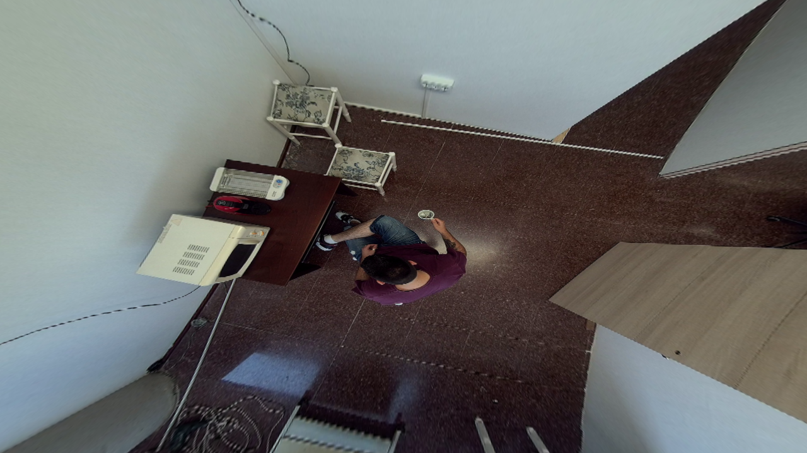

# depth_anything_v2_ros2

[](https://opensource.org/licenses/Apache-2.0)
[](https://github.com/grupo-avispa/depth_anything_v2_ros2/actions/workflows/build.yml)

## Overview
This package is a ROS2 wrapper for the [depth_anything_v2](https://github.com/DepthAnything/Depth-Anything-V2) library. It provides a ROS2 node that subscribes to a camera topic and publishes the depth map of the scene.

 |        *RGB*        |         *Depth*         |
 | :-----------------: | :---------------------: |
 |  |  |


The depth_anything_v2_ros2 package has been tested under [ROS2] jazzy on [Ubuntu] 22.04. This is research code, expect that it changes often and any fitness for a particular purpose is disclaimed.

## Installation
### Building from Source

#### Dependencies

- [Robot Operating System (ROS) 2](https://docs.ros.org/en/jazzy/) (middleware for robotics),
- [depth_anything_v2](https://github.com/DepthAnything/Depth-Anything-V2) (library for depth estimation),
- [torch](https://pytorch.org/) (deep learning framework)

#### Building

To build from source, clone the latest version from the main repository into your colcon workspace and install the python dependencies by running the following commands:
```bash
cd colcon_workspace/src
git clone --recurse-submodules https://github.com/grupo-avispa/depth_anything_v2_ros2.git -b main
pip3 install -r requirements.txt
```
Before building, make sure to download the depth_anything_v2 model weights and place them in the `models` directory. You can download them [here](https://huggingface.co/depth-anything).

Then, install the ROS2 dependencies using rosdep and build the package using:
```bash
cd colcon_workspace
rosdep install -i --from-path src --rosdistro jazzy -y
colcon build --symlink-install
```

## Usage

With some RGB image source running, run the depth_anything_v2_ros2 node with:
```bash
ros2 launch depth_anything_v2_ros2 default.launch.py
```

## Nodes

### depth_anything

This node subscribes to a camera topic and publishes the depth map of the scene.

#### Subscribed Topics

* **`camera/color/image_raw`** ([sensor_msgs/Image])

	The RGB image topic.

#### Published Topics

* **`depth`** ([sensor_msgs/Image])

	The depth map estimated of the scene.

#### Parameters

* **`image_topic`** (string, default: "camera/color/image_raw")

	Topic where the image will be subscribed.

* **`depth_image_topic`** (string, default: "depth")

	Topic where the raw depth image will be published.

* **`device`** (string, default: "cuda:0")

	Device to use for the inference (`cpu` or `cuda`).

* **`model_file`** (string, default: "depth_anything_v2_vits.pth")

	 Path to the model, located in the `models` directory.

* **`encoder`** (string, default: "vits")

	Encoder to use for the inference (`vits`, `vitb` or `vitl`).


[Ubuntu]: https://ubuntu.com/
[ROS2]: https://docs.ros.org/en/jazzy/
[sensor_msgs/Image]: https://docs.ros2.org/jazzy/api/sensor_msgs/msg/Image.html
